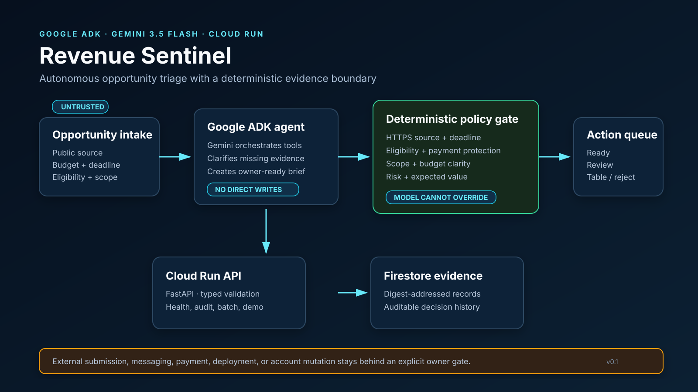

# Architecture

## System purpose

Revenue Sentinel separates generative planning from facts that must not drift. Gemini and Google ADK decide which auditable function to call and turn results into a concise brief. A deterministic engine owns every hard gate and score. The model cannot promote an expired, ineligible, invalid-source, or dust-value opportunity to `ready`.

## Request flow

1. A caller sends one typed opportunity or a batch of up to 100 to the FastAPI service on Cloud Run.
2. Pydantic rejects unknown fields, negative values, oversized lists, and malformed request shapes before audit code runs.
3. The audit engine evaluates canonical HTTPS source, deadline, eligibility, evidence coverage, buyer/sponsor verification, payment protection, budget clarity, scope clarity, and potential value.
4. Hard failures become `reject`; values below USD 1 become `table`; verified, low-risk, clearly scoped work may become `ready`; everything else becomes `review`.
5. A bounded probability produces expected value. The canonical input and output produce a SHA-256 evidence digest.
6. The deployed service writes the result to Firestore using the digest as the document ID. Local runs can use memory or a chained JSONL ledger.
7. The action queue preserves `owner review` and `owner approval` boundaries. No audit function sends a message, submits an entry, spends money, signs, or changes an account.

## Google technology

- `google-adk` defines `revenue_sentinel`, a Gemini 3.5 Flash agent with two plain-Python tools: deterministic audit and evidence-brief creation.
- Gemini interprets the user's goal, calls the correct tool, requests missing facts, and explains the result.
- Cloud Run hosts the FastAPI service and credential-free demo.
- Firestore persists deployed audit evidence.
- Vertex AI supplies Gemini credentials in the Cloud Run deployment configuration.

## Trust boundaries

| Boundary | Enforcement |
|---|---|
| Opportunity text is untrusted | It is parsed as typed data and never evaluated as instructions. |
| Model vs. decision | The model calls tools; deterministic code returns the decision. |
| Local vs. external action | The engine emits a visible gate; no tool performs an external write. |
| Unknown vs. false | Nullable facts remain unknown and route to review. |
| Audit integrity | A canonical payload produces a SHA-256 digest; local JSONL records form a hash chain. |
| Cloud identity | Application Default Credentials and a dedicated service account; no secrets in source. |

## Failure behavior

- Invalid or expired deadlines are visible findings.
- Unsupported or non-HTTPS sources are rejected.
- Missing eligibility never becomes ready.
- Unverified payment or buyer evidence increases risk and routes to review.
- Firestore is selected only by deployment configuration; credential-free local mode remains available.
- A failed Gemini call does not remove the deterministic API or demo.

## Verified deployment

Revision `revenue-sentinel-00002-t5j` is live on Cloud Run. The public service, bounded Gemini 3.5 Flash tool call, matching Firestore document, Cloud log, one-instance ceiling, and three-region uptime check were verified on August 25, 2026. The demo video must show this evidence directly.
